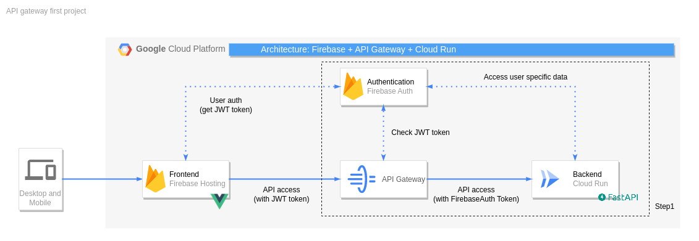

# firebase-auth-hosting-api-gateway-cloudrun

This repository is dedicated to accomplishing the following features:
- API authentification using API Gateway in GCP
- Frontend hosting using Firebase hosting
- Login page by Firebase auth UI
- User-specific page
  - User name
  - User ID
- Restricted message; Only authorized users have access to this message.
General page
- The greeting message that accessible to all users.
- FastAPI backend using GCP Cloud-Run

FastAPI has the following API endpoints:
- **Authentification required:**
  - /user_info; user id, user name
  - /special_message; "You are special!"
- **Authentification not required:**
  - /greeting_message; "Welcome back, sir!"

## Architecture
The system architecture is shown in the figure below:

## Task
- [ ] Construct the FastAPI backend
- [ ] Configure the API gateway(The step1 box in the arch fig.)
- [ ] Test the API access with authorization
- [ ] Build the frontend side

